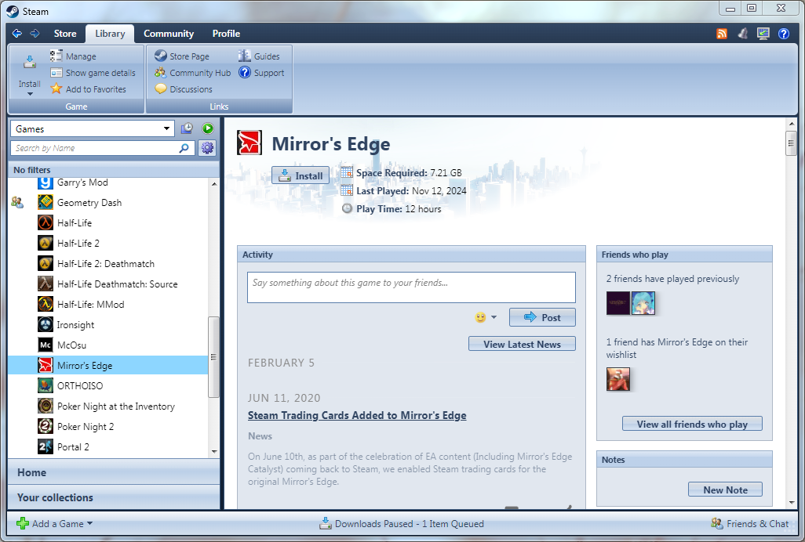
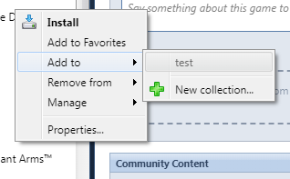
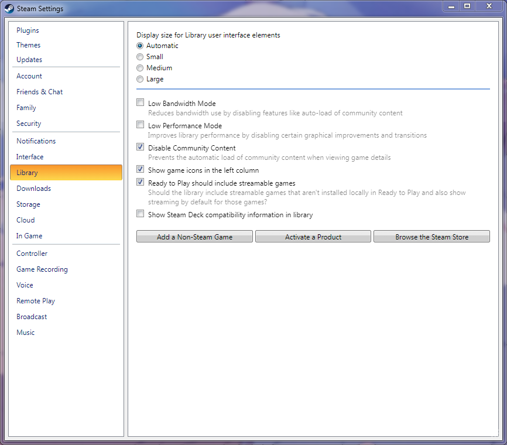
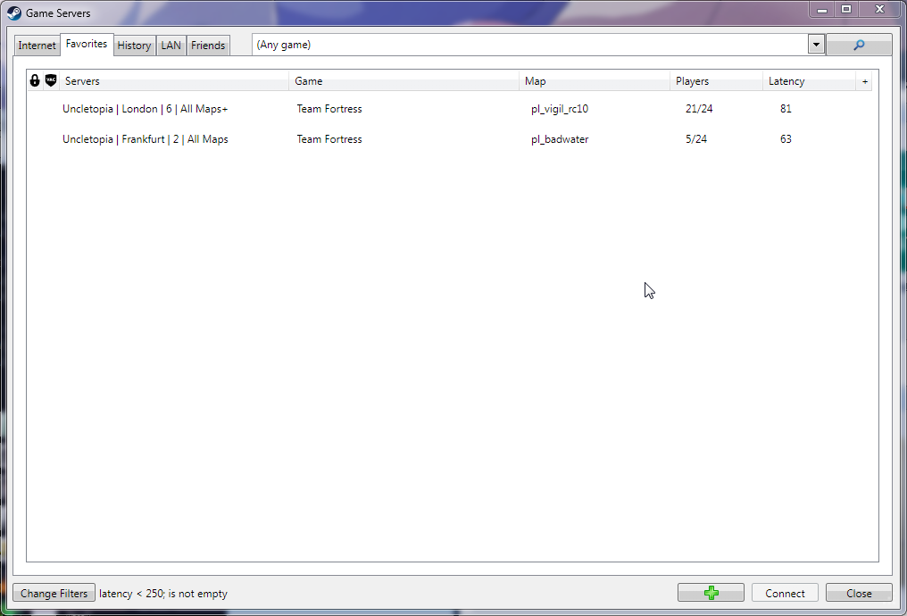
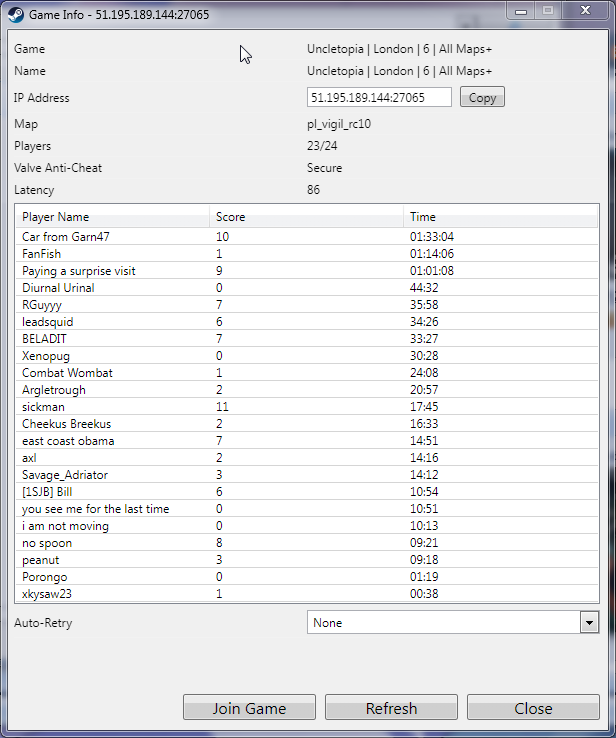

# **INSTALL THE MOTHERFUCKING PLUGIN**

This theme requires a [plugin](https://steambrew.app/plugin?id=dc691b7d877b) for the top bar and some other additional elements. The menu bar, links to a game's store page, community hub, etc. and some other things will not be accessible if not installed. Learn to read if you missed this.

In case you can't access settings to enable the plugin - either access it from your system tray or press Win+R and run `steam://open/settings`.

# Microsoft Office 2007 Styled Theme

Based on a mockup by MondySpartan: https://www.deviantart.com/mondyspartan/art/Steam-Office-2007-Styled-Mockup-1060261068

Other previews

## Titlebar is missing

It's going to be available in a separate plugin in the future. It's not released yet because it doesn't start early enough to modify `window.open` before the main window appears (but works for everything else). The screenshot only includes it so I don't have to take another one.
