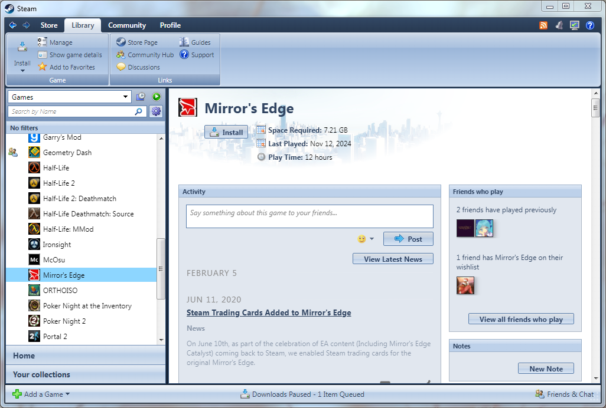
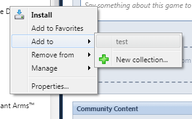
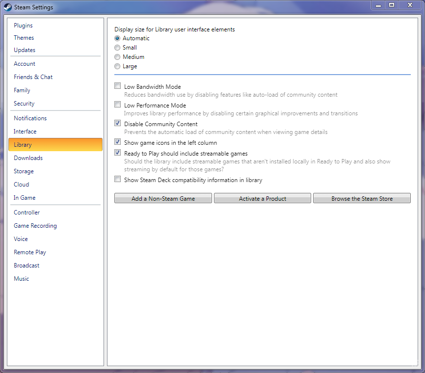
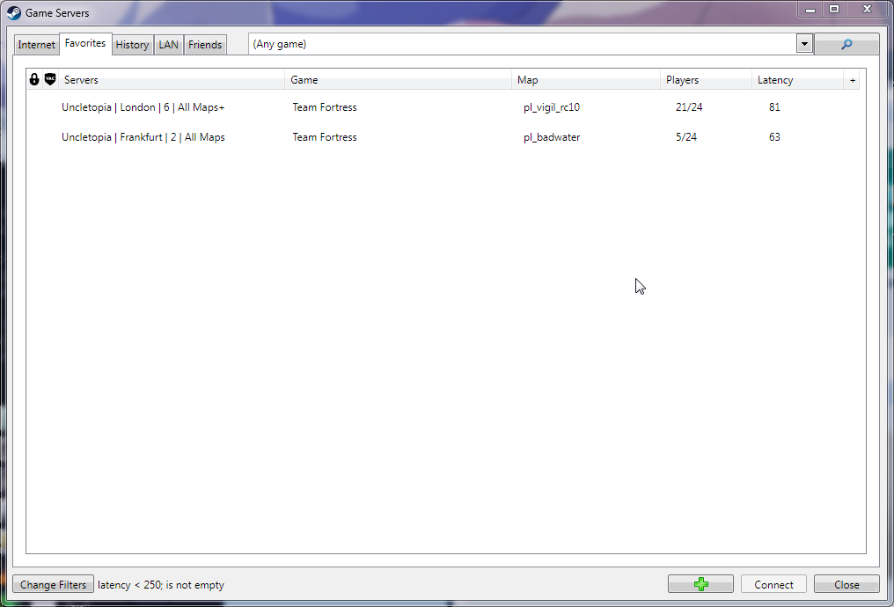
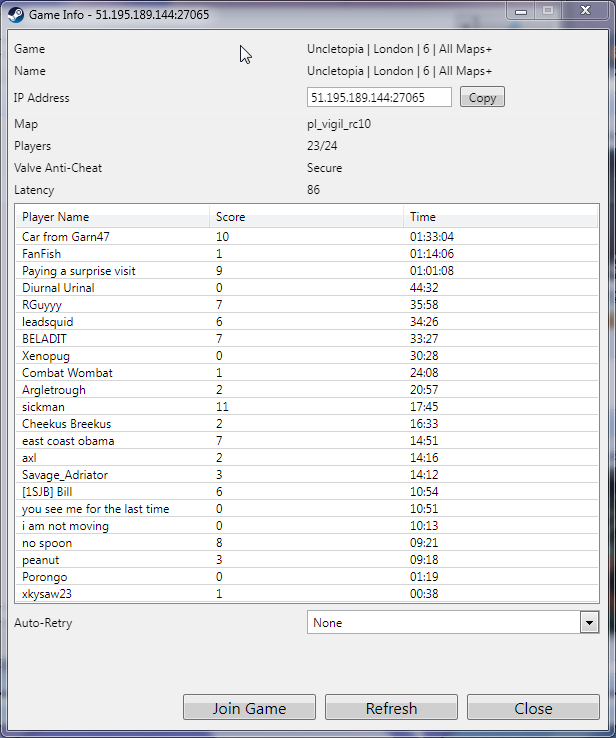

# **INSTALL THE MOTHERFUCKING PLUGIN**

(change link here lol XDDDDDDDDDDDDDDDDDDDDDD)
This theme requires a [plugin](wat) for the top bar and some other additional elements. It will still work if not installed, but the main idea revolves around having it installed. In case the plugin stops working, the theme will work, but look as if it wasn't installed.

# Microsoft Office 2007 Styled Theme

Based on a mockup by MondySpartan: https://www.deviantart.com/mondyspartan/art/Steam-Office-2007-Styled-Mockup-1060261068

Other previews

## System titlebar

Use the [Change Window Params plugin](https://steambrew.app/plugin?id=70961284c213) and enable "Use system titlebar".
